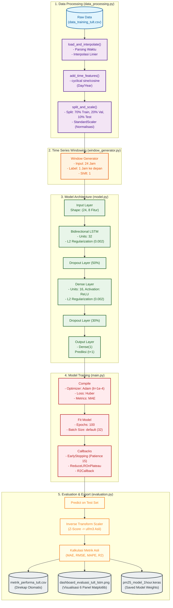

# Arsitektur Pipeline Predictive PM2.5 (TULT - Pure LSTM)

Dokumen ini berisi pemodelan visual untuk alur kerja (pipeline) penuh dari awal persiapan data hingga akhir evaluasi pada algoritma **Murni LSTM** yang dialokasikan di Gedung TULT.

> [!NOTE]
> Diagram ini menggunakan ekstensi sintaks **Mermaid**.

### Keterangan Lapisan (Layers)
- **Input Features (8 Variabel):** `pm25`, `temperature`, `humidity`, `pm25_diff`, `Day sin`, `Day cos`, `Year sin`, `Year cos`.
- **Regulasi Anti-Overfitting:** Dibangun langsung terintegrasi menggunakan L2 constraint pada bobot koneksi `Bidirectional LSTM` (32 unit) dan `Dense` (16 unit) yang diselingi rasio pemutusan sel neuron *Dropout* sebesar 50% dan 30%.
- **Mekanisme Otomatis:** Sistem sudah meredam *Learning Rate* perlahan secara instan jika pergerakan validasi stagnan (*plateau*) di titik peluruhan ke-5 komputasi, dan memberhentikan komputasi (*early stopping*) sepenuhnya jika tak ada pembaruan dalam 15 rentetan putaran (epoch).
- **Evaluasi Hilir:** Hasil prediksi jaringan mesin (format normalisasi Z-Score) diterjemahkan ulang ke konversi format `ug/m3` menggunakan koefisien rata-rata `StandardScaler` sehingga perhitungannya langsung valid di kehidupan nyata!
